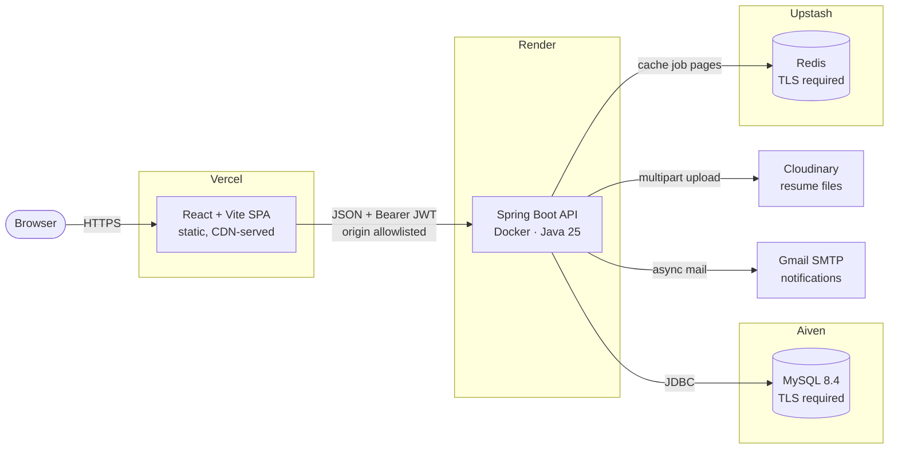

# DevConnect

A job board that ranks roles by how closely they match a developer's actual skill set, rather than by keyword — built on Spring Boot 4 and Java 25, with a React client, Redis-cached search, and a schema that migrates itself.

| | |
| --- | --- |
| 🌐 **Live app** | **https://dev-connect-delta-pied.vercel.app** |
| ⚙️ **API** | https://devconnect-backend-u07y.onrender.com |
| 📖 **API docs (Swagger UI)** | https://devconnect-backend-u07y.onrender.com/swagger-ui/index.html |

> **The API sleeps when idle.** Render's free tier spins the service down after 15 minutes,
> and a JVM cold-starting on half a CPU takes 1–2 minutes. Open
> [`/health`](https://devconnect-backend-u07y.onrender.com/health) first and wait for
> `{"success":true}` — then the app is instant.

<!--
  DEMO RECORDING — add one and uncomment the line below.
  Record 20–30 seconds: search a role, view the match ring, apply, then shortlist as a
  recruiter. Convert with Gifski (mac) or ScreenToGif (Windows), keep it under ~8 MB, and
  commit it as docs/demo.gif.

  
-->

---

## Features

**Core**

- ✅ JWT authentication with role-based access — developer, recruiter, admin
- ✅ Developer profiles: bio, location, years of experience, skills, LinkedIn, resume
- ✅ Recruiter company profiles and job posting with required skills and expiry
- ✅ Public, paginated, filterable job search — by skill, location and work style
- ✅ One-click applications with an optional cover note
- ✅ Recruiter applicant review — full candidate profile, shortlist or pass
- ✅ Email on registration, on application, and on every decision
- ✅ Resume upload to Cloudinary (raw storage, so the file keeps its format)

**Beyond the basics**

- ✅ **Skill-proximity ranking** — Jaccard similarity, not text search (see below)
- ✅ **Redis-cached search** with a Jackson serializer that works around Spring's inability to serialise a `Page`
- ✅ **Self-migrating schema** — Flyway builds a brand-new database from scratch on first boot
- ✅ **Scheduled expiry sweep** — closes lapsed listings and evicts stale cache entries
- ✅ **Notification address of your choice** — route mail to a secondary email
- ✅ **Multi-stage Docker build** — 84 MB app jar in a 463 MB image, no Maven or JDK shipped
- ✅ **One-command local stack** — `docker compose up` for API, MySQL and Redis
- ✅ Interactive OpenAPI documentation

---

## Tech stack

| Layer | Technology | Why it's there |
| --- | --- | --- |
| Language | **Java 25** (LTS) | Records, pattern matching, virtual-thread-ready runtime |
| Framework | **Spring Boot 4.0.6** / Spring Framework 7 | REST API, DI, configuration binding |
| Security | **Spring Security 6** + **JJWT** | Stateless JWT auth, method-level role checks |
| Persistence | **Spring Data JPA** / **Hibernate 7.2** | Entity mapping and repositories |
| Database | **MySQL 8** | Relational data — users, jobs, applications, skills |
| Migrations | **Flyway 11** | Schema lives in version control, not in a database |
| Cache | **Redis** (Upstash) | Caches job-listing pages; invalidated by the expiry sweep |
| Mail | **Spring Mail** + Gmail SMTP | Async notifications on application and decision |
| File storage | **Cloudinary** | Resume uploads, kept out of the app's ephemeral filesystem |
| Docs | **Springdoc OpenAPI 3** | Generated, browsable API reference |
| Frontend | **React 19** + **Vite 6** | SPA client |
| Routing / forms | **React Router 7**, **React Hook Form** | 11 client routes, validated forms |
| HTTP | **Axios** | Interceptors attach the JWT and normalise errors |
| Build | **Maven**, **Docker** (multi-stage) | Reproducible builds, identical image everywhere |
| Hosting | **Vercel**, **Render**, **Aiven**, **Upstash** | Entirely free tiers |

---

## Architecture



Four providers, one image. The same Dockerfile builds what runs locally and what runs on
Render, so every address and credential arrives as an environment variable and nothing
about the deployment is compiled in.

---

## How the interesting parts work

### Skill-proximity ranking

A developer searching jobs gets a match percentage per listing, computed as **Jaccard
similarity** over skill-id sets:

```
score = |developer skills ∩ job skills| / |developer skills ∪ job skills| × 100
```

The union in the denominator is what makes it useful: a job wanting one skill you have
does not outrank a job wanting five of your six. Keyword search cannot express that.

### Caching a Spring `Page`

Spring's `PageImpl` has no default constructor, so Jackson cannot deserialise it out of
Redis. Rather than caching entities and re-paginating, results are mapped to a
`CustomPageResponse` DTO that serialises cleanly. A sample test run:

```text
First call  (cache miss → MySQL): 407 ms
Second call (cache hit  → Redis):  28 ms
→ 14.54× faster
```

### A schema that builds itself

Flyway owns the schema and `ddl-auto` is `validate`, so Hibernate verifies the mapping and
changes nothing. Point the app at an empty database and it creates all eight tables,
constraints included, then records what it ran in `flyway_schema_history`.

This replaced `ddl-auto: update`, which had silently declined to add unique constraints to
tables that already existed — so `users.user_name` and `users.email` had been unique on
some databases and not others, with the fix existing in no file.

---

## Running it locally

**Prerequisites:** JDK 25, Docker Desktop, Node 20+.

```bash
git clone https://github.com/HarshGupta1135/Dev-Connect-.git
cd Dev-Connect-
cp .env.example .env          # then fill in mail, Cloudinary and JWT values
```

```bash
# 1. databases (leave running — data persists in a Docker volume)
docker compose up -d mysql redis

# 2. API on :8080 — Flyway creates the schema on first start
./mvnw spring-boot:run

# 3. client on :3000, in a second terminal
cd devconnect-frontend && npm install && npm run dev
```

Open **http://localhost:3000**. On Windows use `mvnw.cmd` in place of `./mvnw`.

The Vite dev server proxies `/api`, `/admin` and `/health` to port 8080, so the browser
only ever sees one origin and no CORS configuration is needed for development.

### Configuration

`application.yaml` contains no secrets; every credential is read from the git-ignored
`.env`, and real environment variables take precedence, so deployments need no file.

Anything missing fails startup rather than falling back to a default — deliberately, but
the error can be indirect: a missing `DB_PASSWORD` surfaces as `Access denied for user`,
because Spring leaves an unresolved placeholder as literal text. Check `.env` against
`.env.example` first.

### Everything in containers

```bash
docker compose up --build     # API + MySQL + Redis
docker compose down           # stop, keep the data
docker compose down -v        # stop and delete the databases
```

MySQL and Redis publish on **3307** and **6380** so they never collide with instances
already installed on the host; the API reaches them by service name over the compose
network. Point a client (MySQL Workbench) at `localhost:3307`.

Use this before deploying, to exercise the real image. For day-to-day work prefer
`./mvnw spring-boot:run` — it starts in ~8 seconds with devtools reload and a debugger,
against the same containerised database, so nothing needs migrating between the two.

`docker compose down -v` deletes the volume with nothing left to recover from. Dump first:

```bash
docker exec devconnect-mysql sh -c 'exec mysqldump -uroot -p"$MYSQL_ROOT_PASSWORD" --databases devconnect' > backups/devconnect-$(date +%F).sql
```

### Changing the schema

Add a file to `src/main/resources/db/migration` — never edit one that has already run,
since Flyway checksums them and refuses to start on a mismatch:

```
V2__add_something.sql
```

Aiven enforces `sql_require_primary_key`, so every table must declare a primary key.

---

## API documentation

Interactive Swagger UI, generated from the controllers:

- **Live:** https://devconnect-backend-u07y.onrender.com/swagger-ui/index.html
- **Local:** http://localhost:8080/swagger-ui/index.html
- **OpenAPI JSON:** `/v3/api-docs`

Authenticate with `POST /api/auth/login`, then send `Authorization: Bearer <token>`.

| Area | Endpoints |
| --- | --- |
| Auth | `POST /api/auth/register`, `POST /api/auth/login` |
| Jobs (public) | `GET /api/jobs`, `GET /api/jobs/{id}` |
| Account | `GET /api/account/me`, `PUT /api/account` |
| Developer | `GET·POST·PUT /api/developer/profile`, `POST /api/developer/profile/resume`, `POST /api/developer/apply`, `GET /api/developer/applications` |
| Recruiter | `GET·POST·PUT /api/recruiter/profile`, `GET·POST·PUT /api/recruiter/jobs`, `PATCH /api/recruiter/jobs/{id}/close`, `GET /api/recruiter/jobs/{jobId}/applications`, `PATCH /api/recruiter/applications/{id}/status` |
| Skills | `GET /api/get/all/skills`, `POST /api/add/skills` *(admin)* |
| Admin | `GET /admin/get-all-users`, `POST /admin/add-admin` |

---

## Deployment

Four free tiers, no code changes between local and production:

| Component | Provider | Notes |
| --- | --- | --- |
| Client | **Vercel** | Root directory `devconnect-frontend`; `VITE_API_BASE_URL` points at the API |
| API | **Render** | Blueprint from `render.yaml`, Dockerfile builder, health check on `/health` |
| MySQL | **Aiven** | Free plan has no expiry; database is `defaultdb`, user `avnadmin`, TLS required |
| Redis | **Upstash** | TLS required — `REDIS_SSL=true` |

### API on Render

New → **Blueprint** → this repo. `render.yaml` pins the Dockerfile builder and health-checks
`/health`, so a failed migration fails the deploy instead of going live broken. Supply the
variables it prompts for. Do not set `PORT`: Render assigns it and `server.port` follows.

For Aiven, `sslMode=REQUIRED` is not optional — it refuses plaintext connections, and its
own connection URI spells the parameter `ssl-mode`, which the JDBC driver ignores:

```
DB_URL=jdbc:mysql://<host>:<port>/defaultdb?sslMode=REQUIRED
DB_USERNAME=avnadmin
```

### Client on Vercel

Set **Root Directory** to `devconnect-frontend` — this is not a standalone repository. One
variable:

```
VITE_API_BASE_URL=https://devconnect-backend-u07y.onrender.com
```

Vite only exposes `VITE_`-prefixed names to client code, and inlines them at **build** time,
so changing it needs a redeploy. A `REACT_APP_` name is Create React App's convention and
is silently ignored here.

`vercel.json` rewrites every path to `index.html`; without it only `/` works, because Vercel
looks for a file at `/jobs` and finds none.

### Then point them at each other

```
CORS_ALLOWED_ORIGINS=https://your-app.vercel.app     # on Render
```

Exact match, no trailing slash. The backend sends no CORS headers while this is empty,
which is why local development needs none.

<details>
<summary>Railway, if you would rather pay for no cold starts (~$10/month)</summary>

Railway has managed MySQL and Redis in one dashboard, but its free plan carries $1/month of
credit against roughly $9–10/month of usage for three always-on services. `railway.toml` is
in the repo. Its `DATABASE_URL` and `REDIS_URL` cannot be used as-is — compose the JDBC URL
from the individual variables instead:

```
DB_URL=jdbc:mysql://${{MySQL.MYSQLHOST}}:${{MySQL.MYSQLPORT}}/${{MySQL.MYSQLDATABASE}}
REDIS_SSL=false
```
</details>

---

## Tests

```bash
./mvnw test
```

The suite is integration-level `@SpringBootTest`, so it needs MySQL, Redis and mail
credentials available — start `docker compose up -d mysql redis` first. It covers the
caching speedup and the scheduled expiry sweep.

---

## Project layout

```
├── src/main/java/com/example/DevConnect/
│   ├── config/          security, Redis, Cloudinary, admin seeding
│   ├── controller/      REST endpoints
│   ├── dto/             request and response shapes
│   ├── entity/          JPA entities
│   ├── exception/       typed exceptions + @RestControllerAdvice
│   ├── filter/          JWT authentication filter
│   ├── scheduler/       status-mail sweep
│   ├── service/         business logic
│   └── util/            JWT helper, Jaccard scoring
├── src/main/resources/db/migration/    Flyway SQL
├── devconnect-frontend/                React + Vite client
├── Dockerfile                          multi-stage build
├── docker-compose.yml                  API + MySQL + Redis
├── render.yaml                         Render blueprint
└── railway.toml                        Railway config
```
